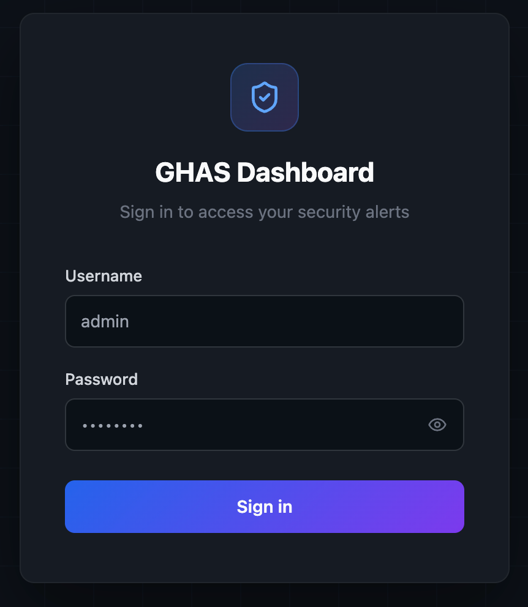
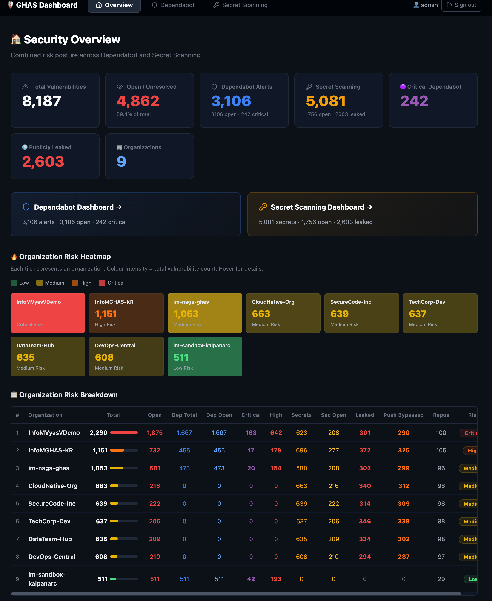
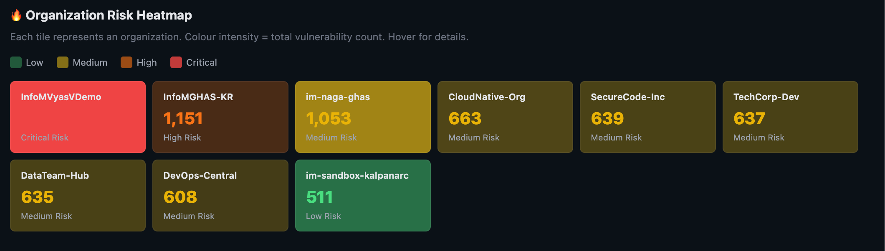
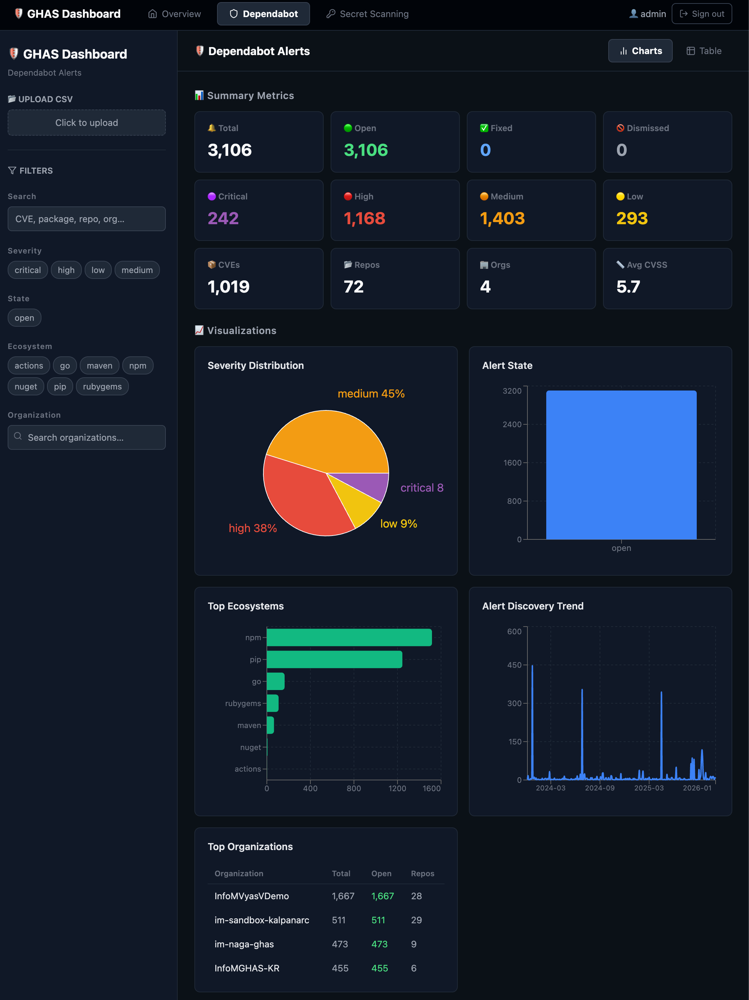
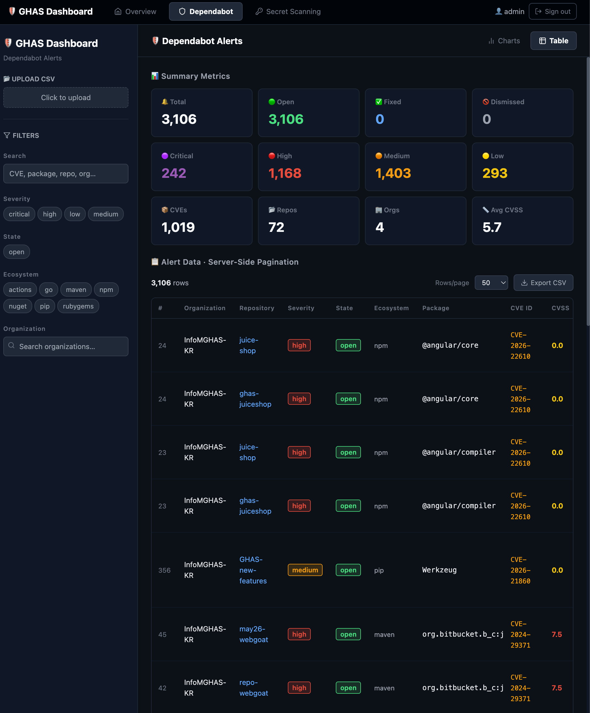
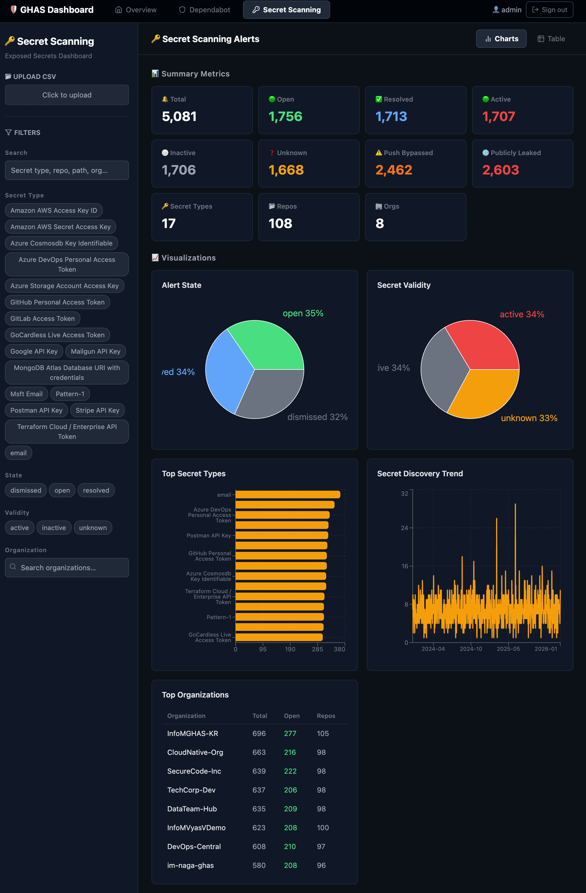
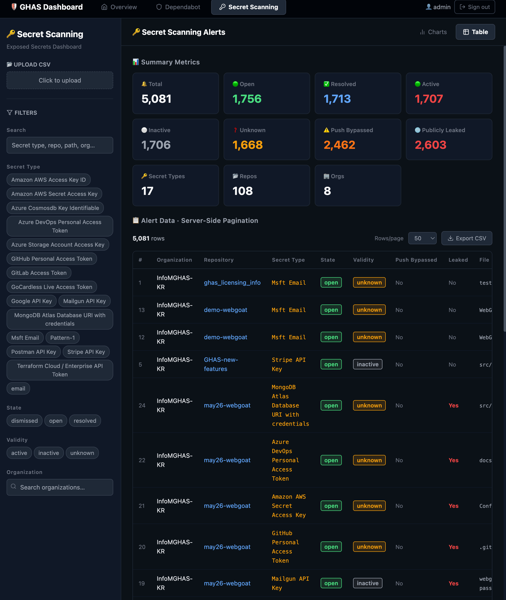

# 🛡️ GHAS Enterprise Dashboard

High-performance, authenticated dashboard for GitHub Advanced Security (GHAS) data — Dependabot alerts and Secret Scanning alerts from large CSVs (1M+ rows).

**Stack:** React + Vite · FastAPI · DuckDB · TanStack Query/Table · Recharts · JWT Auth

---

## Architecture

```
┌─────────────────────────────────────────────────────────────────┐
│  Browser                                                        │
│  ┌──────────────┐                                               │
│  │  LoginPage   │──POST /auth/login────┐                        │
│  └──────────────┘                      │                        │
│  ┌──────────────────────────────────────┐                       │
│  │  React / Vite (:3000)               │                       │
│  │  ──────────────────────             │                       │
│  │  • LandingPage (Overview)           │                       │
│  │  • Dependabot Dashboard             │                       │
│  │    - MetricsBar / Charts            │                       │
│  │    - AlertsTable (server-paged)     │                       │
│  │  • Secret Scanning Dashboard        │                       │
│  │    - MetricsBar / Charts            │                       │
│  │    - AlertsTable (server-paged)     │                       │
│  └──────────┬───────────────────────────┘                       │
│             │                                                   │
│             │  /api/* (Vite proxy)                              │
│             │  Authorization: Bearer token                      │
└─────────────┼───────────────────────────────────────────────────┘
              ▼
┌────────────────────────────────────────────────────────────────┐
│  FastAPI (:8000)                                               │
│  ┌──────────┐  ┌────────────┐  ┌─────────────────────────────┐ │
│  │ auth.py  │  │  main.py   │  │  engine.py (Dependabot)     │ │
│  │ JWT+BCrypt│ │  routes    │  │  secrets_engine.py (Secrets)│ │
│  └──────────┘  └──────┬─────┘  │  - DuckDB query engines     │ │
│                       │        │  - CSV ingestion            │ │
│                       ▼        │  - Thread-local conns       │ │
│              ┌─────────────┐   │  - JSON-safe serialisation  │ │
│              │  DuckDB x2  │◀──┘  - Cache cleanup            │ │
│              │  .duckdb    │                                  │ │
│              └──────┬──────┘                                  │ │
│                     │  one-time ingestion                     │ │
│                     ▼                                         │ │
│              ┌─────────────────────────┐                      │ │
│              │  dependabot_alerts.csv  │                      │ │
│              │  secret_scanning.csv    │                      │ │
│              └─────────────────────────┘                      │ │
└─────────────────────────────────────────────────────────────────┘
```

### Key Design Decisions

- **Filtering / metrics / charts** — pure SQL `GROUP BY` / `COUNT` / `DISTINCT` in DuckDB (sub-10 ms on 1M rows)
- **Table** — server-side SQL `LIMIT`/`OFFSET` pagination; only the current page (50 rows) is sent to the browser
- **Organization filter** — typeahead search via `ILIKE` query (not a full list) to scale beyond 10K+ orgs
- **Thread safety** — `threading.local()` connections so concurrent FastAPI requests never share DuckDB state
- **JSON safety** — `NaN`, `NaT`, `Inf`, and numpy scalars are sanitised before serialisation
- **DuckDB cache** — ingested `.duckdb` files are fingerprinted by filename+size+mtime; old caches are auto-cleaned
- **Authentication** — JWT tokens (HS256) with bcrypt-hashed passwords; all data endpoints are protected

---

## Screenshots

### 🔐 Login Page

> JWT-authenticated login with bcrypt password hashing



### 🏠 Security Overview (Landing Page)

> Combined risk posture across Dependabot and Secret Scanning — total vulnerabilities, open/unresolved counts, and quick-nav cards to each dashboard



### 🔥 Organization Risk Heatmap

> Colour-coded heatmap showing the riskiest organizations by total vulnerability count (green → yellow → orange → red)



### 🛡️ Dependabot Dashboard — Charts

> Severity distribution, alert state, top ecosystems, discovery trend, and top organizations — all powered by DuckDB SQL aggregations



### 🛡️ Dependabot Dashboard — Table

> Server-side paginated table with severity/state badges, CVE links, CVSS scores, and GitHub alert links



### 🔑 Secret Scanning Dashboard — Charts

> Secret type distribution, alert state, validity breakdown, discovery trend, and top organizations



### 🔑 Secret Scanning Dashboard — Table

> Paginated table with validity badges, push-protection bypassed flags, publicly leaked indicators, file paths, and GitHub links



> **Note:** To add your own screenshots, capture them from the running dashboard and save to `docs/screenshots/`. See [`docs/screenshots/README.md`](docs/screenshots/README.md) for naming conventions.

---

## Quick Start

### Prerequisites

- **Python 3.10+**
- **Node.js 18+** and npm

### One-command start (recommended)

```bash
chmod +x start.sh
./start.sh
```

This will:

1. Create a Python virtualenv and install backend dependencies
2. Start the FastAPI backend on `http://localhost:8000`
3. Install frontend npm packages (if needed)
4. Start the React/Vite dev server on `http://localhost:3000`

Then open **http://localhost:3000** and sign in.

### Manual start (two terminals)

**Terminal 1 — Backend:**

```bash
cd backend
python3 -m venv .venv
source .venv/bin/activate
pip install -r requirements.txt
uvicorn main:app --host 127.0.0.1 --port 8000 --reload
```

**Terminal 2 — Frontend:**

```bash
cd frontend
npm install
npm run dev
```

### Stopping the application

| Method                     | How to stop                                                         |
| -------------------------- | ------------------------------------------------------------------- |
| **`start.sh`**             | Press `Ctrl+C` — the script traps the signal and kills both servers |
| **Manual (two terminals)** | Press `Ctrl+C` in each terminal                                     |
| **VS Code tasks**          | Click the terminal tab for each task and press `Ctrl+C`             |

---

## Authentication

All data endpoints require a valid JWT `Bearer` token. The login page is shown automatically when unauthenticated.

### Default credentials

|              |         |
| ------------ | ------- |
| **Username** | `admin` |
| **Password** | `admin` |

### Custom credentials (via environment variables)

```bash
export DASHBOARD_USERNAME=myuser
export DASHBOARD_PASSWORD=mysecretpassword
export JWT_SECRET=$(openssl rand -hex 32)    # use a strong random secret in production
export JWT_EXPIRE_MINUTES=480                 # token lifetime in minutes (default: 8 hours)
./start.sh
```

### Auth flow

1. `POST /auth/login` with `username` + `password` (form-encoded) → returns `{ access_token, token_type, username, expires_in }`
2. All subsequent requests include `Authorization: Bearer <token>`
3. Token is stored in `localStorage`; auto-cleared and redirected to login on `401`

---

## Loading Data

**Option A — Auto-load:** Place CSV files in the project root (next to `backend/`):

- `dependabot_alerts.csv` — for Dependabot vulnerability alerts
- `secret_scanning.csv` — for Secret Scanning alerts

Both files will be ingested automatically on the first API call after login.

**Option B — Upload in UI:** Use the "Click to upload" button in each dashboard's sidebar.
Files up to 1 GB work fine; DuckDB ingests them in seconds.

### DuckDB cache behaviour

| Scenario                            | What happens                                        |
| ----------------------------------- | --------------------------------------------------- |
| Same CSV uploaded again (unchanged) | Reuses existing `.duckdb` — skips ingestion         |
| Same filename, different content    | New `.duckdb` created (fingerprint changed)         |
| Different CSV filename              | New `.duckdb` created                               |
| **Old `.duckdb` files**             | **Automatically deleted** when a new one is created |

Cache is stored in `backend/.cache/`.

---

## API Endpoints

### Public (no auth required)

| Method | Path          | Description                            |
| ------ | ------------- | -------------------------------------- |
| `POST` | `/auth/login` | Authenticate; returns JWT access token |
| `GET`  | `/auth/me`    | Returns current user info              |
| `GET`  | `/health`     | `{ status: "ok" }`                     |

### Protected (Bearer token required)

#### Overview

| Method | Path        | Description                                                       |
| ------ | ----------- | ----------------------------------------------------------------- |
| `GET`  | `/overview` | Combined risk overview across Dependabot + Secret Scanning by org |

#### Dependabot Endpoints

| Method | Path                                       | Description                                    |
| ------ | ------------------------------------------ | ---------------------------------------------- |
| `POST` | `/upload`                                  | Upload Dependabot CSV; ingests into DuckDB     |
| `GET`  | `/filter-options`                          | Distinct severities, states, ecosystems        |
| `GET`  | `/filter-options/orgs?q=&limit=50`         | Typeahead search for organization names        |
| `GET`  | `/metrics`                                 | Aggregate counts (total, open, critical, etc.) |
| `GET`  | `/alerts?page=1&page_size=50&severity=...` | Paginated table rows                           |
| `GET`  | `/alerts/export`                           | Download filtered CSV                          |
| `GET`  | `/charts/severity`                         | Severity breakdown                             |
| `GET`  | `/charts/state`                            | State breakdown                                |
| `GET`  | `/charts/ecosystem`                        | Top 10 ecosystems                              |
| `GET`  | `/charts/org`                              | Top 20 orgs with open/total/repos              |
| `GET`  | `/charts/trend`                            | Daily alert creation trend                     |

#### Secret Scanning Endpoints

| Method | Path                                                  | Description                                     |
| ------ | ----------------------------------------------------- | ----------------------------------------------- |
| `POST` | `/secrets/upload`                                     | Upload Secret Scanning CSV; ingests into DuckDB |
| `GET`  | `/secrets/filter-options`                             | Distinct secret types, states, validity values  |
| `GET`  | `/secrets/filter-options/orgs?q=&limit=50`            | Typeahead search for organization names         |
| `GET`  | `/secrets/metrics`                                    | Aggregate counts (total, open, leaked, etc.)    |
| `GET`  | `/secrets/alerts?page=1&page_size=50&secret_type=...` | Paginated table rows                            |
| `GET`  | `/secrets/alerts/export`                              | Download filtered CSV                           |
| `GET`  | `/secrets/charts/secret-type`                         | Secret type breakdown                           |
| `GET`  | `/secrets/charts/state`                               | State breakdown                                 |
| `GET`  | `/secrets/charts/validity`                            | Validity breakdown                              |
| `GET`  | `/secrets/charts/org`                                 | Top 20 orgs with open/total/repos               |
| `GET`  | `/secrets/charts/trend`                               | Daily alert creation trend                      |

API docs (Swagger UI): **http://localhost:8000/docs**

---

## Project Structure

```
ghas-enterprise-dashboard/
├── start.sh                          # one-command start (both servers)
├── dependabot_alerts.csv             # default Dependabot CSV (auto-loaded)
├── secret_scanning.csv               # default Secret Scanning CSV (auto-loaded)
├── LICENSE                           # project license
├── backend/
│   ├── main.py                       # FastAPI app, routes, auth wiring
│   ├── auth.py                       # JWT authentication (bcrypt + python-jose)
│   ├── engine.py                     # DuckDB query engine for Dependabot
│   ├── secrets_engine.py             # DuckDB query engine for Secret Scanning
│   ├── requirements.txt              # Python dependencies
│   └── .cache/                       # auto-created .duckdb files (gitignored)
├── frontend/
│   ├── index.html
│   ├── package.json
│   ├── vite.config.ts                # dev proxy /api → :8000
│   ├── tailwind.config.js
│   ├── postcss.config.js
│   ├── tsconfig.json
│   └── src/
│       ├── main.tsx                  # React entry + AuthProvider + QueryClient
│       ├── App.tsx                   # Auth gate, dashboard switcher, tab navigation
│       ├── AuthContext.tsx            # Auth state, localStorage token management
│       ├── api.ts                    # Dependabot API types, fetch with Bearer token
│       ├── secretsApi.ts             # Secret Scanning API types
│       ├── useFilters.ts             # Dependabot filter state hook
│       ├── useSecretsFilters.ts      # Secret Scanning filter state hook
│       ├── badges.ts                 # Severity/state badge styling
│       ├── index.css                 # Tailwind + custom styles
│       └── components/
│           ├── LandingPage.tsx        # Security overview (combined metrics)
│           ├── LoginPage.tsx          # Login form (username/password)
│           ├── Sidebar.tsx            # Dependabot filters + CSV upload
│           ├── MetricsBar.tsx         # Dependabot summary metric cards
│           ├── Charts.tsx             # Dependabot Recharts visualisations
│           ├── AlertsTable.tsx        # Dependabot TanStack Table with pagination
│           └── secrets/
│               ├── SecretsSidebar.tsx        # Secret Scanning filters + CSV upload
│               ├── SecretsMetricsBar.tsx     # Secret Scanning summary metrics
│               ├── SecretsCharts.tsx         # Secret Scanning visualisations
│               └── SecretsAlertsTable.tsx    # Secret Scanning table with pagination
├── docs/
│   └── screenshots/                  # Dashboard screenshots
│       └── README.md                 # Screenshot naming conventions
└── .vscode/
    └── tasks.json                    # VS Code tasks for starting servers
```

---

## Performance at Scale (1M+ rows)

| Component              | Behaviour                                  | Latency |
| ---------------------- | ------------------------------------------ | ------- |
| CSV → DuckDB ingestion | One-time; cached with fingerprinting       | 2–5 sec |
| `/metrics`             | Single aggregation query                   | < 10 ms |
| `/charts/*`            | `GROUP BY` queries, 10–20 rows returned    | < 10 ms |
| `/alerts`              | `LIMIT 50 OFFSET x`, only 50 rows leave DB | < 5 ms  |
| `/filter-options/orgs` | `ILIKE` on indexed column, max 50 results  | < 5 ms  |
| `/alerts/export`       | Full table CSV dump (worst case)           | 1–3 sec |
| Browser rendering      | Never receives more than 50 table rows     | Instant |

The browser never does any heavy computation — all aggregation happens server-side in DuckDB SQL.
